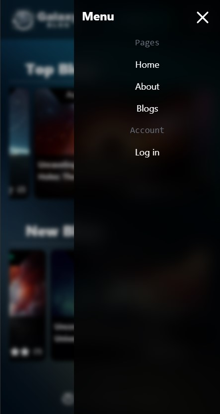
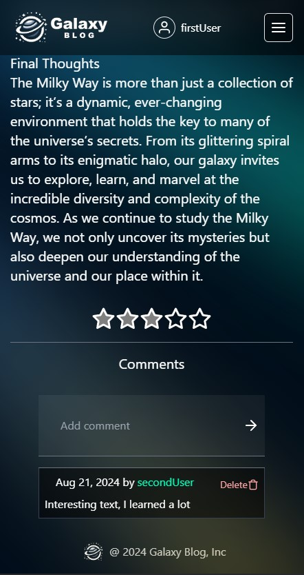
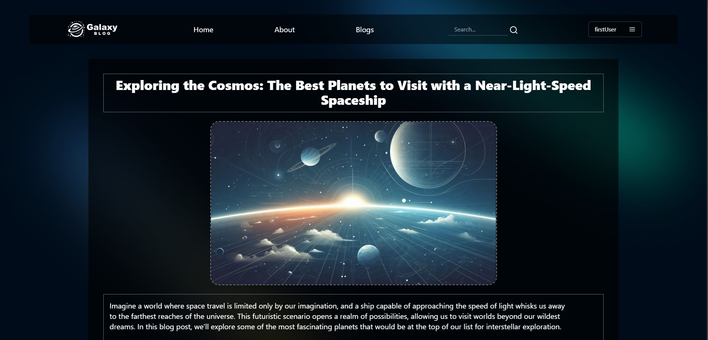

# Galaxy Blog

Simple Blog Platform with Full User Account Management and Interactive Blog Features

This project is a blog platform that offers a range of functionalities, including:

- **User Registration and Login System**: Secure account creation and access using bcrypt for password hashing, with hashed passwords stored in a MongoDB database.
- **Browse and Search Blogs**: View the top-rated and latest blogs or search by blog title or author.
- **Interactive Blog Engagement**: Comment on and rate blogs, providing feedback and engaging with the community.
- **Create and Manage Your Own Blogs**: Users can add, edit, and delete their own blog posts, allowing for personalized content creation.

The project is a form of training for me and the first project written in TypeScript. I try to keep the project structure as correct as possible, allowing for easy development of the website in the future.

## Page views

<h3 align="center"> Login page </h3>

<h4 align="center">(Desktop)</h4>

    

<h4 align="center">(Mobile)</h4>

    
    

<h3 align="center"> Home page </h3>

<h4 align="center">(Desktop)</h4>

    

<h4 align="center">(Mobile)</h4>

    
    

<h3 align="center"> Blog page </h3>

<h4 align="center">(Desktop)</h4>

    
    

<h4 align="center">(Mobile)</h4>

    
    

<h3 align="center"> New/edit blog page </h3>

<h4 align="center">(Desktop)</h4>

    

<h4 align="center">(Mobile)</h4>

    
    

<h3 align="center"> About page </h3>

<h4 align="center">(Desktop)</h4>

    

<h3 align="center"> User profile </h3>

<h4 align="center">(Mobile)</h4>

    

