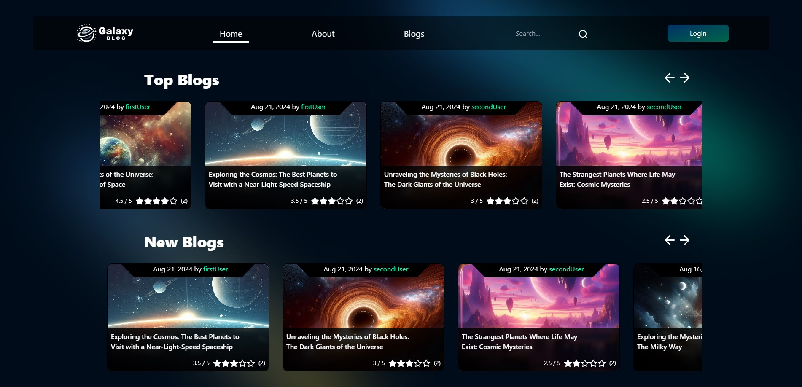

# Galaxy Blog (in progress...)

Simple blog type website featuring account system, adding blogs and commenting them.

Next, I plan to add the function of adding ratings to blogs and complete all subpages with styling.

The project is a form of training for me and the first project written in TypeScript. I try to keep the project structure as correct as possible, allowing for easy development of the website in the future.

## Page views

<h3 align="center"> Login page </h3>

    

    
    

<h3 align="center"> Home page </h3>

    

    
    

